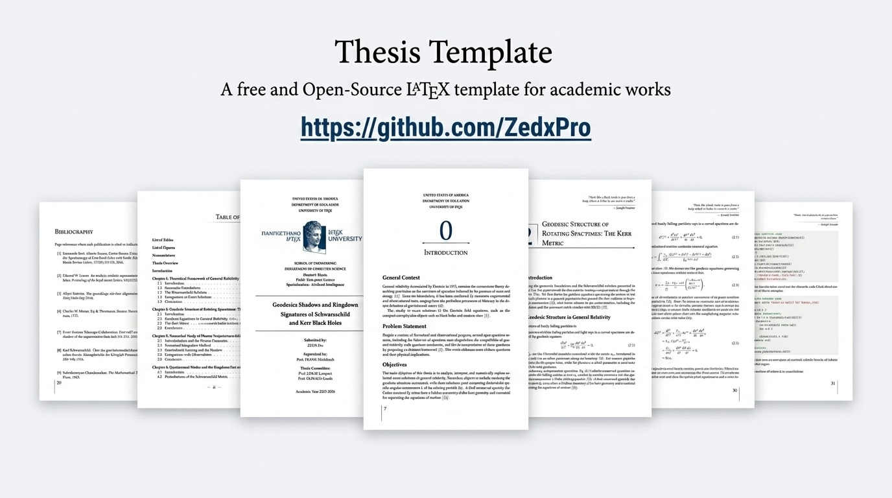

# 🎓 Elegant & Modern Thesis Template

<div align="center">



<br/><br/>


</div>

A clean, high-performance **XeLaTeX** template tailored for Master's and Ph.D. dissertations. Designed with focus on typography, modern page layouts, and clean code structure.

---

## ✨ Key Highlights

* **📖 Optimized Layout:** Pre-configured margins and two-sided layout ready for printing and binding.
* **⚡ Modern Fonts:** Built to handle system OpenType/TrueType fonts seamlessly via `fontspec`.
* **📁 Clean Project Structure:** Modular design separating chapters, bibliography, and custom packages for easy navigation.
* **📚 Citation Ready:** Integrated with `biblatex` and `biber` for effortless reference management.

---

## 🛠️ Requirements & Setup

> [!IMPORTANT]
> This template requires **XeLaTeX** to compile properly. Standard `pdfLaTeX` is not supported.

### Recommended Environment:
* **TeX Distribution:** TeX Live / MikTeX / Overleaf (XeLaTeX engine)
* **Bibliography Backend:** `biber`

---

## ⚡ Quick Compilation

To build the complete document with all citations and references, run:

```bash
latexmk -xelatex main.tex
